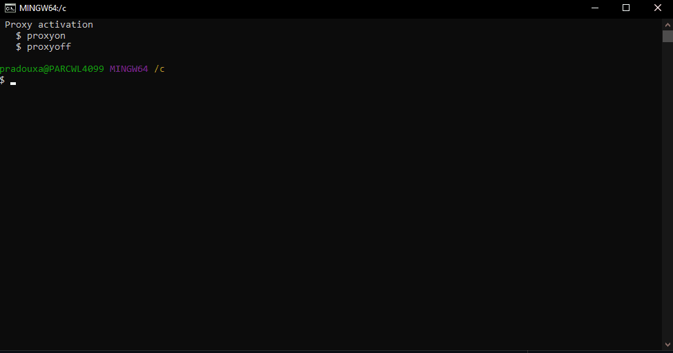
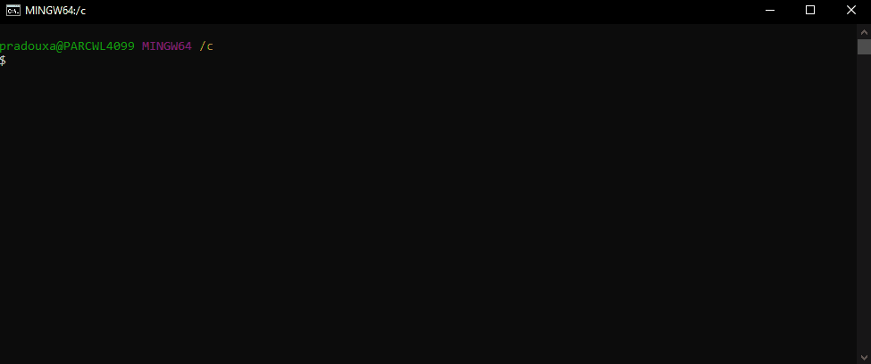

# Zephyr Startup

This readme is a step-by-step guide that will allow you to install the Zephyr environment on your computer and quickly run an application or sample code. In our case, we will use GitBash as the command terminal for installing and compiling our future Zephyr projects.\
It is divided into the following parts:

1. Software installation required
2. Proxy Setting
3. Zephyr installation
4. Zephyr Repository Architecture
5. Run an example project

This guide was written, among other things, thanks to the Zephyr **[Getting Started Guide](https://docs.zephyrproject.org/latest/develop/getting_started/index.html)**.

> [!IMPORTANT]
> This guide presents one method to accomplish the task, though other methods exist. You can adapt this approach as you wish. The process outlined here is effective and has been tested successfully.

> [!NOTE]
> Last update December 2024.
_______________________________________________________________


# 1. Software installation required

To be able to install your Zephyr environment, please **Download & Install** the following dependencies needed & **Add it to PATH** if it is not automatically did during installation. All the installation files are available in the `Zephyr_Startup\installation_files` folder. Please follow these steps:

> [!NOTE]
> The following software installations are a way of doing things and have been verified and approved.\
> You may optionally keep versions of software that you have already installed Or change the download directory.

###### GitBash
  - Launch *Git-2.46.1-64-bit.exe* and let all default settings.

###### Python 3.12
- Launch *python-3.12.4-amd64.exe*
- Check `Use admin privileges when installing py.exe` & `Add python.exe to PATH`
- Select `Install Now` to start the installation

###### Cmake
- Launch *cmake-3.30.0-windows-x86_64.msi*
- During installation, check  `Add CMake to the PATH environment variable`

###### Wget
- Extract the wget zip folder to `C:/wget-1.21.4-win64/`
- Add `C:\wget-1.21.4-win64` to **PATH**

###### 7zip
- Launch *7z2408-x64.exe*
- Add `7z` to **PATH**


_______________________________________________________________


# 2. Proxy Setting

> [!NOTE]
> This section is only useful if you need to configure a proxy to access an external network.

To install our Zephyr environment, we will need to access remote servers. We must therefore configure the proxy with our username and password to be able to access them.\
To do this, after installing **Git Bash**, you should find in the path `C:\Users\my_user_name` the file `.bashrc`. This is a script of the Bash command interpreter that Bash executes each time it is started interactively.\
*If this file does not exist, you must create it*.\
\
Edit this file with a text editor and add the code below (Don't forget to **modify the [YOUR_PROXY_IP]** variable with the IP of your Proxy):

```python
function proxyon() {
echo -n "USERNAME :"
read -e username
echo -n "PASSWORD :"
read -es password
ProxyIP=[YOUR_PROXY_IP] #need to be modified with your Proxy IP
export proxy_username=${username}
export proxy_password=${password}
export proxy=http://${ProxyIP}:8080
export http_proxy=http://${proxy_username}:${proxy_password}@${ProxyIP}:8080
export https_proxy=http://${proxy_username}:${proxy_password}@${ProxyIP}:8080
#git config --global http.proxy http://${proxy_username}:${proxy_password}@${ProxyIP}:8080
#git config --global http.proxy http://${proxy_username}:${proxy_password}@${ProxyIP}:8080
echo -e "\nProxy environment variables set (http_proxy, https_proxy)."
}

function proxyoff() {
unset HTTP_PROXY
unset http_proxy
unset HTTPS_PROXY
unset https_proxy
unset FTP_PROXY
unset ftp_proxy
unset RSYNC_PROXY
unset rsync_proxy
echo -e "\nProxy environment variables removed."
}

echo " Proxy activation"
echo "   $ proxyon"
echo "   $ proxyoff"

#eval $(ssh-agent -s)
```

> [!WARNING]
> Depending on your geographic region, you may need to change the value of the *ProxyIP* parameter on line 6 with a suitable Proxy IP.


In order to verify that your modification works properly, open a GitBash terminal and you should see the following text appear at the top of the terminal:
> Proxy activation
> $ proxyon
> $ proxyoff


You just have to type the following command line and enter your username and password:

```shell
proxyon
```



> [!IMPORTANT]  
> At the end of a Git Bash session, remember to do a `proxyoff` command to clear your login and password that have been temporarily stored by the *.bashrc* script.


_______________________________________________________________


# 3. Zephyr installation

### Creating of the Zephyr Repository

First, start by creating a repository for your Zephyr environment. For my part, it will be `C:/Zephyr_Repo`. Then, change directory to this specific location. You can do that with the following command line:

```shell
mkdir Zephyr_Repo
cd Zephyr_Repo
```



### Configuring the Zephyr Environment

In this part you will find a series of commands needed to configure the Zephyr environment. Before each command line you will find a little description of the command.

> [!NOTE]
> Some of the following commands may take a while to complete, this is normal.

In a *zephyrproject* folder, create a python environment, it will generate a folder *env-st*:
```shell
python -m venv zephyrproject/.venv
```

Activate the python virtual environment:
```shell
source zephyrproject/.venv/Scripts/activate
```

Install the **West** tool for Zephyr (It will be the swiss-army knife command line tool for all your Zephyr projects):
```shell
pip install west
```

> [!NOTE]  
> If after run the pip install west command, a prompt asks you to update pip, you can do so by running the following command:
```shell
python.exe -m pip install --upgrade pip
```

Initialize the Zephyr project, it will generate a hidden file *.west/config*:
```shell
west init zephyrproject
```

Move to your project location:
```shell
cd zephyrproject
```

Get the Zephyr source code (this may take a while):
```shell
west update
```

Install CMake packages:
```shell
west zephyr-export
```

Install more python tools for Zephyr:
```shell
pip install -r zephyr/scripts/requirements.txt
```

Install ninja tools for Zephyr:
```shell
pip install ninja
```

### Install the Zephyr SDK

The **Zephyr Software Development Kit (SDK)** contains toolchains for each of Zephyr’s supported architectures, which include a compiler, assembler, linker and other programs required to build Zephyr applications.\
It also contains additional host tools, such as custom QEMU and OpenOCD builds that are used to emulate, flash and debug Zephyr applications.

Download and unzip the **[Zephyr SDK](https://github.com/zephyrproject-rtos/sdk-ng/releases/tag/v0.16.8)** in your Zephyr Repository folder destination (`C:/Zephyr_Repo`).


Move to the *zephyr-sdk-0.16.8* folder that you just unzipped:
```shell
cd ../zephyr-sdk-0.16.8
```

Run the *setup* command to install the Zephyr SDK.\
If asked, answer ```Y``` to *host tools*, ```Y``` to *Zephyr SDK Cmake package*, ```Y``` for *arm toolchain*, ```N``` to other.
```shell
./setup.cmd
```

> [!NOTE]  
> Congratulations, your Zephyr Environment has just been installed!

> [!TIP]
> If you want to create another zephyr project, you just need to go back to this guide at the **Configuring the Zephyr Environment** part.


_______________________________________________________________


# 4. Zephyr Repository Architecture

This is a simplified representation of the Zephyr repository architecture:

> [!NOTE]  
> You may have some differences with your repository but this gives you an overview.

```
zephyrproject/                       //WORKSPACE
   ├─── .venv/                       //Python virtual environments config
   ├─── .west/                       //west config
   │          └─── config
   │
   └─── app1/                        //User application 1
   │          └── src
   │          │      └── main.c      //main application file
   │          │
   │          ├── CMakeLists.txt     //links the app files directory
   │          ├── app.overlay        //devicetree overlay specification
   │          ├── prj.conf           //Kconfig (application-specific values)
   │          └─── VERSION           //app version info
   │
   └─── app2/ User application 2
   │          └── src
   │          │      └── main.c
   │          ├── […]
   │
   ├─── bootloader/
   ├─── build/
   ├─── modules/
   ├─── tools/
   └──── zephyr/                      //Zephyr repository application
	    ├── arch/                 //STM32 core handling related code
	    ├── boards/               //all supported board config
	    ├── cmake/                //cmake common script
	    ├── doc/
	    ├── drivers/              //Zephyr drivers
	    ├── dts/                  //device tree for SoCs
	    ├── include/
	    ├── kernel/               //kernel code
	    ├── lib/                  //built in libraries
	    ├── misc/
	    ├── modules/              //Kconfig files
	    ├── samples/              //samples applications
	    ├── scripts/
	    ├── share/
	    ├── snippets/
	    ├── soc/                  //common soc codes
	    ├── submanifests/
	    ├── subsys/               //sub system
            └── tests/                //test specific applications

```

> [!NOTE]  
> For more information you can refer to the Zephyr **[Application Development](https://docs.zephyrproject.org/latest/develop/application/index.html#overview)** page.


_______________________________________________________________


# 5. Run an example project

> [!NOTE]  
>If you are following this tutorial from the beginning you can skip the first steps. Go directly to step 3.

`1` - Go to your Zephyr Repository:
```shell
cd Zephyr_Repo
```

`2` - Activate the python virtual environment:
```shell
source zephyrproject/.venv/Scripts/activate
```

`3` - Go to the Zephyr workspace application:
```shell
cd zephyrproject
```

`4` - Build the blinky example for the board of your choice (in my case it will be a NUCLEO-U575ZI):
```shell
west build -p always -b nucleo_u575zi_q zephyr/samples/basic/blinky
```

> [!NOTE]  
> This may take some time to build.

> [!NOTE]  
> You can find all the ST supported board in the folder `.../zephyrproject/zephyr/boards/st/`


> [!NOTE]  
> For more information on the *west* command and its arguments, please visit **[this](https://docs.zephyrproject.org/latest/develop/west/index.html)** page.

`5` - Connect your board and flash the application:
```shell
west flash
```

**Now you should see the User LED blinking.**


### Troubleshooting

If the flash command (*west flash*) doesn't work, verify if CubeProgrammer is added in the `boards\st\xxxxxx\board.cmake`.\
It is needed to put it in first position like this:
```c
board_runner_args(stm32cubeprogrammer "--port=swd" "--reset-mode=hw")

include(${ZEPHYR_BASE}/boards/common/stm32cubeprogrammer.board.cmake)
```
