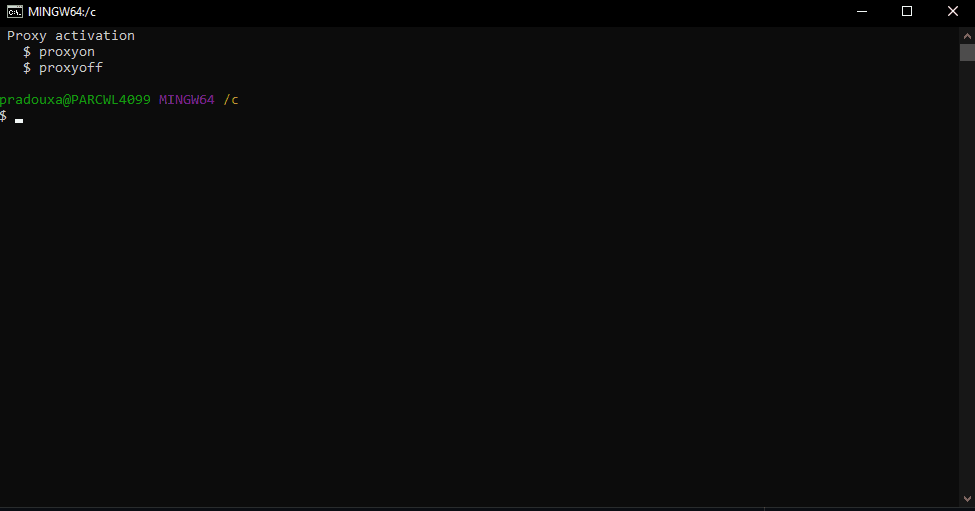

To install our Zephyr environment, we will need to access remote servers. We must therefore configure the proxy with our username and password to be able to access them.

To do this, after installing **Git Bash**, you should find in the path `C:\Users\my_user_name` the file `.bashrc`. This is a script of the Bash command interpreter that Bash executes each time it is started interactively.

Edit this file with a text editor and add the code below:

```c
function proxyon() {
echo -n "USERNAME :"
read -e username
echo -n "PASSWORD :"
read -es password
ProxyIP=lps5.gnb.st.com
export proxy_username=${username}
export proxy_password=${password}
export proxy=http://${ProxyIP}:8080
export http_proxy=http://${proxy_username}:${proxy_password}@${ProxyIP}:8080
export https_proxy=http://${proxy_username}:${proxy_password}@${ProxyIP}:8080
export http_stmyum_proxy=http://${ProxyIP}:8080
#git config --global http.proxy http://${proxy_username}:${proxy_password}@${ProxyIP}:8080
#git config --global http.proxy http://${proxy_username}:${proxy_password}@${ProxyIP}:8080
echo -e "\nProxy environment variables set (http_proxy, https_proxy, http_stmyum_proxy)."
}

function proxyoff() {
unset HTTP_PROXY
unset http_proxy
unset HTTPS_PROXY
unset https_proxy
unset http_stmyum_proxy
unset HTTP_STMYUM_PROXY
unset FTP_PROXY
unset ftp_proxy
unset RSYNC_PROXY
unset rsync_proxy
echo -e "\nProxy environment variables removed."
}

echo " Proxy activation"
echo "   $ proxyon"
echo "   $ proxyoff"

cd c:
#eval $(ssh-agent -s)
```


-------------------------------------------------

> ## WARNING
> *Depending on your geographic region, you may need to change the value of the `ProxyIP` parameter on line 6 with a suitable Proxy IP.*
>  


-------------------------------------------------

In order to verify that your modification works properly, open a GitBash terminal and you should see the following text appear at the top of the terminal:

> Proxy activation

> $ proxyon

> $ proxyoff


You just have to type the following command line and enter your username and password:

```shell
proxyon
```




-------------------------------------------------

> ## IMPORTANT  
> *At the end of a Git Bash session, remember to do a `proxyoff` command to clear your login and password that have been temporarily stored by the `.bashrc` script.*
>  

-------------------------------------------------
