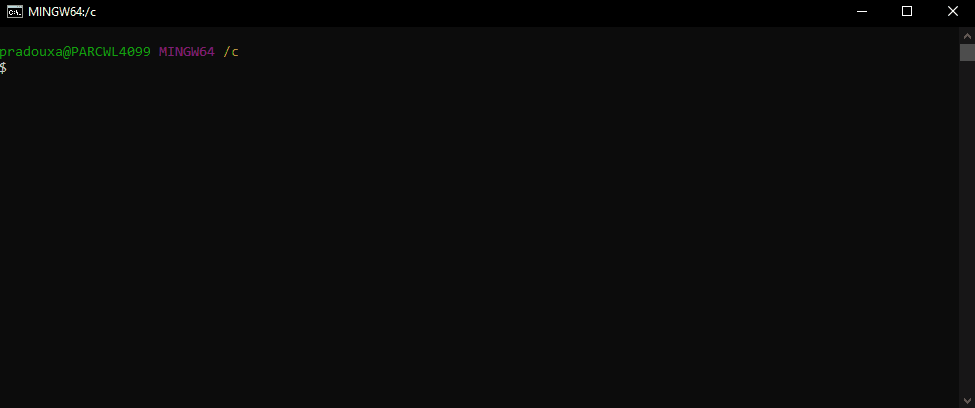

# Creating of the Zephyr Repository

First, start by creating a repository for your Zephyr environment. For my part, it will be `C:/Zephyr_Repo`. Then, change directory to this specific location. You can do that with the following command line:

```shell
mkdri Zephyr_Repo
cd Zephyr_Repo
```



# Configuring the Zephyr Environment

In this part you will find a series of commands needed to configure the Zephyr environment. Before each command line you will find a little description of the command.

In a *zephyrproject* folder, create a python environment, it will generate a folder *env-st*:

```shell
python -m venv zephyrproject/.venv
```

Activate the python virtual environment:

```shell
source zephyrproject/.venv/Scripts/activate
```

Install the **West** tool for Zephyr (It will be the swiss-army knife command line tool for all your Zephyr projects):

```shell
pip install west
```

Initialize the Zephyr project, it will generate a hidden file *.west/config*:

```shell
west init zephyrproject
```

Move to your project location:

```shell
cd zephyrproject
```

Get the Zephyr source code (this may take a while):

```shell
west update
```

Install CMake packages:

```shell
west zephyr-export
```

Install more python tools for Zephyr:

```shell
pip install -r zephyr/scripts/requirements.txt
```


# Install the Zephyr SDK

The **Zephyr Software Development Kit (SDK)** contains toolchains for each of Zephyr’s supported architectures, which include a compiler, assembler, linker and other programs required to build Zephyr applications.\
It also contains additional host tools, such as custom QEMU and OpenOCD builds that are used to emulate, flash and debug Zephyr applications.

Download and unzip the **[Zephyr SDK](https://github.com/zephyrproject-rtos/sdk-ng/releases/tag/v0.16.8)** in your Zephyr Repository folder destination.


Move to the *zephyr-sdk-0.16.8* folder that you just unzipped:

```shell
cd ../zephyr-sdk-0.16.8
```

Run the *setup* command to install the Zephyr SDK.\

If asked, answer ```Y``` to *host tools*, ```Y``` to *Zephyr SDK Cmake package*, ```Y``` for *arm toolchain*, ```N``` to other.

```shell
./setup.cmd
```

## NOTE  
**Congratulations, your Zephyr Environment has just been installed!**

## TIP
*If you want to create another zephyr project, you just need to go back to this guide at the `Configuring the Zephyr Environment` part.*
